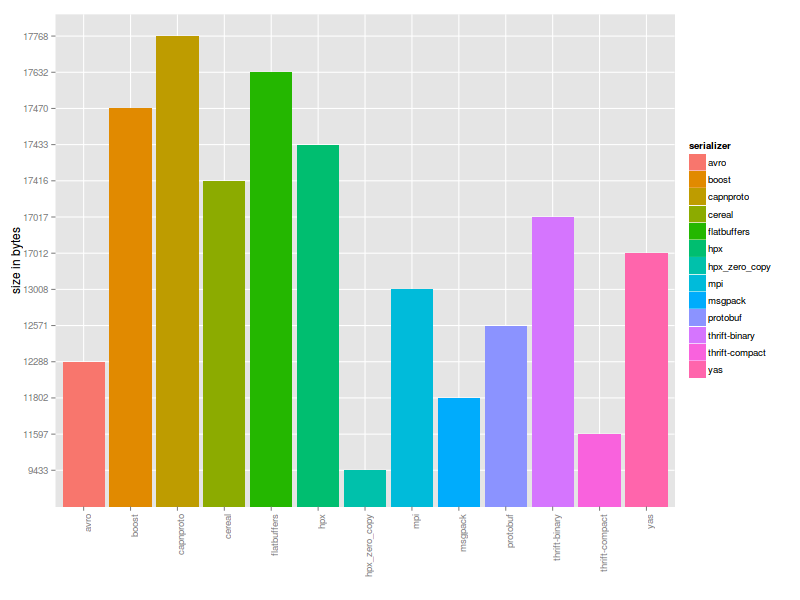
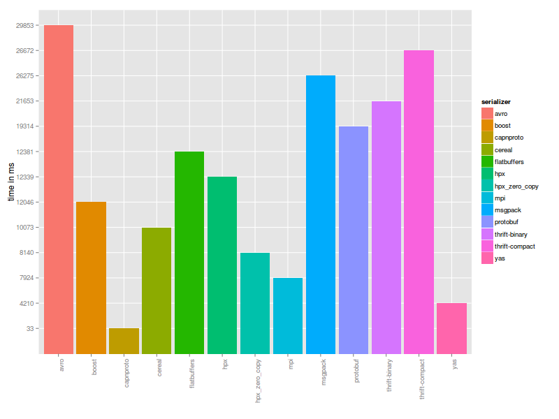

#### [Thrift](http://thrift.apache.org/) vs. [Protobuf](https://code.google.com/p/protobuf/) vs. [Cap’n Proto](https://capnproto.org/) vs. [Boost.Serialization](http://www.boost.org/libs/serialization) vs. [Msgpack](http://msgpack.org/) vs. [FlatBuffers](https://google.github.io/flatbuffers/) vs. [Cereal](http://uscilab.github.io/cereal/index.html) vs. [Avro](http://avro.apache.org/) vs. [HPX](https://github.com/STEllAR-GROUP/hpx) vs. [MPI](https://www.open-mpi.org/) vs. [YAS](https://github.com/niXman/yas) serialization/deserialization time test for C++.

#### Build
This project does not have any external library dependencies. All (boost, thrift etc.) needed libraries are downloaded
and built automatically except HPX (set HPX_DIR for latter), but you need enough free disk space to build all components. To build this project you need a compiler that supports
C++11 features. Project was tested with GCC-6.2.0 (Ubuntu 14.04-x86_64).

```
$ git clone https://github.com/thekvs/cpp-serializers.git
$ mkdir /path/to/build-root/
$ cd /path/to/build-root/
$ cmake /path/to/cpp-serializers -DCMAKE_BUILD_TYPE=Release -DHPX_DIR=...
$ make
```

#### Usage
* Test __all__ serializers, run each serializer 100000 times:
```
$ ./test 100000
```
* Test only __protobuf__ serializer, run it 100000 times:
```
$ ./test 100000 protobuf
```
* Test __protobuf__ and __cereal__ serializers only, run each of them 100000 times:
```
$ ./test 100000 protobuf cereal
```

#### Results

Following results were obtained running 1000000 serialize-deserialize operations 50 times and then averaging results
on a typical desktop computer with `i5` processor running Ubuntu 14.04-x86_64. Compiler was GCC-6.2.0. Exact versions of libraries used are:

* thrift 0.9.3
* protobuf 2.6.0
* capnproto 5.0.2
* boost 1.59.0
* msgpack 1.1.0
* cereal 1.2.1
* avro 1.7.7
* hpx 1.0.0
* mpi 3.0.3
* yas master

| serializer     | object's size | avg. total time |
| -------------- | ------------- | --------------- |
| thrift-binary  | 17017         | 21653           |
| thrift-compact | 11597         | 26672           |
| protobuf       | 12571         | 19314           |
| capnproto      | 17768         | 33 [1]          |
| boost          | 17470         | 12046           |
| msgpack        | 11802         | 26275           |
| flatbuffers    | 17632         | 12381           |
| cereal         | 17416         | 10073           |
| avro           | 12288         | 29853           |
| hpx            | 17433         | 12339           |
| hpx_zero_copy  | 9433          | 8140            |
| mpi            | 13008         | 7924            |
| yas            | 17012         | 4210            |

[[1](https://github.com/STEllAR-GROUP/cpp-serializers/pull/2#issuecomment-171014862)]

Size measured in bytes, time measured in milliseconds.

##### Graphical representations

###### Size



###### Time


